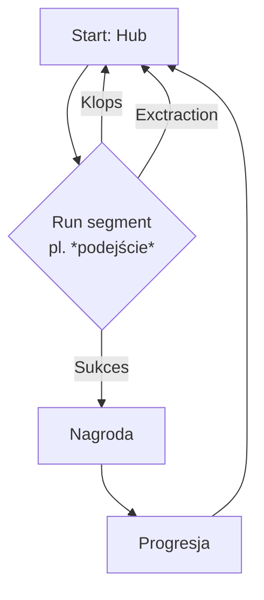

# Projekt podróż

## 1. O grze

`Survivalowy` `roguelite` osadzony w realiach polskiej wsi, skupiający się na walce z wykluczeniem komunikacyjnym. Gra łączy mechanikę `extraction` z losowymi zdarzeniami i systemem pór roku, ubierając trudne tematy w otoczkę miejskiej legendy, może trochę baśni i estetykę 2.5D.

## 2. Inspiracje / gry podobne

### Perspektywa i grafika

- *Don't Starve*, Klei Entertainment, 2013. ==`Perspektywa 2.5D`==. 
- *Hades*, Supergiant Games, 2020. ==`Perspektywa 2.5D`, jest to też `roguelite`==.
- *Boomer Shootery* (np. *Warhammer Boltgun*). ==Wygląd tekstur, postacie jako sprite'y 2D==.

### Motyw drogi, atmosfera i narracja

- *Road 96*, DigixArt, 2021. ==Koncept podróży, losowe wydarzenia podczas drogi==.
- *Keep Driving*, YCJY Games, 2025. ==Koncept podróży, założenie gry==.
- *Pacific Drive*, Ironwood Studios, 2024. ==Koncept podróży, niepokojący klimat==.
- *Silent Hill*, Konami, 1999. ==Sposób poruszania problemów, niepokojący klimat==.
- *Slender: The Eight Pages*, Parsec Productions, 2012. ==Problemy młodzieży ubrane w otoczkę miejskiej legendy==.
- *Darkwood*, Acid Wizard Studio, 2017. ==Przetwarzanie rzeczywistości w baśniowe elementy==.

### Polskość
- *Darkwood*, Acid Wizard Studio, 2017. ==Polski tematyka i estetyka==.
- *Martial Law*, Byte Barrel, 2024. ==Polska tematyka i realia==.
- *This War of Mine*, 11 bit studios, 2014. ==Polska tematyka i poważne podejście do trudnych tematów==.
## 3. Rozgrywka

### 3.1. Główne mechaniki i systemy

1. Pory roku (conajmniej cztery) = różne wyzwania;
2. Meta progresja (`roguelite` ahh element);
3. Elementy extraction (pl. *ekstrakcje*);
4. Random events (pl. *losowe zdarzenia*), przykładowo przeciwnicy
5. Limit czasu;
6. Różne postacie (wstępnie 2 lub 3), mają benefity (lub nie) → różne właściwości, w zależności od pory roku;
7. Mini gierki (np. pseudo *Friday Night Funkin’* w busie, w celu zachowania równowagi);
8. Znajdźki.

### 3.2. Główna pętla rozgrywki

## 4. Design i audio-wideo

### 4.1. UI / UX

- **HUD:** `HP`, `przedmioty` (te mają właściwości **pasywne**, to nie jest jakiś system zarządzania ekwipunkiem).
- **Interfejsy:** głównie **niediegetyczne**, poza np. radiem, czy notesem, gdzie będą **diegetyczne**.
	- Co to jest:
	  **Diegetyczny** odnosi się do elementów gry (dźwięk, interfejsy, HUD) istniejących wewnątrz świata produkcji, słyszalnych lub postrzeganych przez bohaterów, jak dialogi czy muzyka z radia.
	  **Niediegetyczny** opisuje elementy, które pochodzą spoza tego świata i są kierowane tylko do osoby grającej, np. muzyka z tła, która nie ma źródła w scenie, komentarz narratora. 

### 4.2. Grafika

- **Styl graficzny:** `Pixel art` (16-bit albo 32-bit).
- **Perspektywa:** `2.5D`, `side-scroller`.
	- [Przykład](https://i.sstatic.net/SxGjC.png) przykładowy.
	- Co to jest 2.5D perspektywa - czasem nazywana 3/4 perspective lub pseudo-3D, termin na rzut kamery gracza, imituje głębię trójwymiarową, korzystając **głównie** z assetów 2D. [Źródło](https://etu-cnm.uqat.ca/20181-art1211/racj22/TP3/2-5d.html).

### 4.3. Udźwiękowienie

- **Muzyka:**
	- ma stresować (gdy są stresowe momenty);
	- nie może zabraknąć dziedzictwa Polski = disco polo (w busie).
- **SFX:**
	- mroczne ambienty;
	- potencjalnie 32-bitowe efekty dźwiękowe. [Przykład](https://www.youtube.com/watch?v=zKo9O5C-oT0).

## 5. Narracja i światotwórstwo

### 5.1. Typ opowiadania

Historia jest przekazywana w sposób **nielinearny**.

### 5.2. Główny motyw przewodni

Wiadomo = **wykluczenie komunikacyjne**.
Ale poza tym ludzka siła woli. Nie jest łatwo ominąć niebezpiecznego psa i osobę w kryzysie alkoholowym, po drodze, przez cztery pory roku.

### 5.3. Świat
- 2025 rok;
- **Koleszkowice** (fikcyjna wieś);
- Baśniowe elementy:
	- ~~Grywalne postacie dziwnie mają tych samych rodziców (bo ten sam hub, czyli dom);~~
	- Owi rodzice to tylko nogi (jak w Krowa i kurczak);
	- Mędrzec asystujący główne postacie;
	- Troszkę mroku;
- Elementy humorystyczne (np. slapstick, comic relief).

---

Miłego dnia :)
